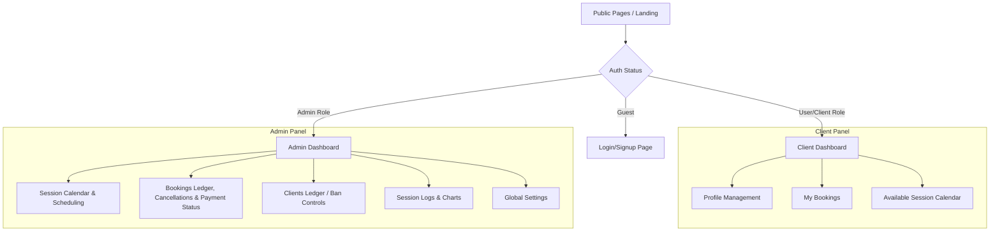

# Implementation Plan — Backend & Dashboard Integration

This plan outlines the architecture, database schema, page routing, and design guidelines for adding a full Supabase backend, authentication, admin dashboard, and client booking portal to the BDD Boxing website.

---

## Decided Architecture (Feedback Applied)

We have aligned on the following architectural paths and features:

1. **Selected Path — Option A: Static Hybrid (Vite + React SPA)**
   - Retain the existing vanilla HTML/CSS public pages (`index.html`, `programs.html`, etc.) for absolute stability, fast load times, and sitemap SEO.
   - Build a React-based Single Page Application (SPA) inside a subfolder (e.g., `/dashboard/`) using **Vite, React, and Shadcn UI** for all authenticated dashboards (signup, login, profiles, admin panel, client portal).

2. **In-Person Payment Tracking**
   - No online payment gateway (Stripe/Cash App API) will be integrated at this stage.
   - Bookings will have a `payment_status` enum of `'pending'` or `'paid'`.
   - Only admins will be able to see and toggle this dropdown status from the Admin Panel. Clients will not see payment controls.

3. **Weekly Scheduling Rules**
   - **Mondays (Fixed)**: Group Class (Beginner Foundations focus) from **7:00 PM - 8:00 PM**.
   - **Tuesdays (Fixed)**: Sparring Session from **8:00 PM - 9:00 PM**.
   - **Other days/times**: Dynamically generated or scheduled manually by Coach Jrob based on his work schedule.

4. **Admin Overbooking & Capacity Controls**
   - The system will enforce capacity limits for standard client sign-ups.
   - Admins can manually book sessions on behalf of registered clients and will have the permission to bypass `max_slots` capacity constraints (overbooking).

5. **User Banishment Enforcement**
   - Banning a user will immediately cancel all of their upcoming active bookings, freeing up slots for other clients.
   - Custom RLS and hooks will block banned users from logging in or fetching database records immediately.

6. **Coach Focus**
   - Coach Jrob is the only trainer for the initial version; no multi-coach logic is required.

---

## Database Design (Supabase PostgreSQL Schema)

### 1. User Profiles & Roles Table
This table stores user profile info and role states. It maps 1-to-1 with Supabase `auth.users`.

```sql
CREATE TYPE user_role AS ENUM ('user', 'client', 'admin');
CREATE TYPE user_status AS ENUM ('active', 'banned');

CREATE TABLE public.profiles (
  id UUID REFERENCES auth.users(id) ON DELETE CASCADE PRIMARY KEY,
  email TEXT NOT NULL UNIQUE,
  full_name TEXT,
  phone TEXT,
  role user_role NOT NULL DEFAULT 'user',
  status user_status NOT NULL DEFAULT 'active',
  created_at TIMESTAMPTZ NOT NULL DEFAULT timezone('utc'::text, now()),
  updated_at TIMESTAMPTZ NOT NULL DEFAULT timezone('utc'::text, now())
);
```

### 2. Session Types
Defines reusable templates for training sessions (e.g. Monday Group Class, Tuesday Sparring, Private Session).

```sql
CREATE TABLE public.session_types (
  id UUID PRIMARY KEY DEFAULT gen_random_uuid(),
  title TEXT NOT NULL,
  description TEXT,
  duration_minutes INTEGER NOT NULL DEFAULT 60,
  created_at TIMESTAMPTZ NOT NULL DEFAULT timezone('utc'::text, now())
);
```

### 3. Training Sessions (Calendar Instances)
Holds specific training session instances on the calendar.

```sql
CREATE TYPE session_status AS ENUM ('active', 'cancelled');

CREATE TABLE public.sessions (
  id UUID PRIMARY KEY DEFAULT gen_random_uuid(),
  session_type_id UUID REFERENCES public.session_types(id) ON DELETE CASCADE,
  datetime TIMESTAMPTZ NOT NULL,
  max_slots INTEGER NOT NULL DEFAULT 1,
  price_usd NUMERIC(10,2) NOT NULL DEFAULT 50.00,
  location TEXT NOT NULL DEFAULT '1012 3rd Ave NW, Hickory, NC 28601',
  status session_status NOT NULL DEFAULT 'active',
  cancel_reason TEXT,
  cancel_datetime TIMESTAMPTZ,
  created_at TIMESTAMPTZ NOT NULL DEFAULT timezone('utc'::text, now())
);
```

### 4. Bookings
Records when a client books a slot in a session. Tracks attendance and payment status.

```sql
CREATE TYPE booking_status AS ENUM ('booked', 'cancelled', 'attended');
CREATE TYPE payment_status AS ENUM ('pending', 'paid');

CREATE TABLE public.bookings (
  id UUID PRIMARY KEY DEFAULT gen_random_uuid(),
  session_id UUID REFERENCES public.sessions(id) ON DELETE CASCADE,
  client_id UUID REFERENCES public.profiles(id) ON DELETE CASCADE,
  status booking_status NOT NULL DEFAULT 'booked',
  payment_status payment_status NOT NULL DEFAULT 'pending',
  created_at TIMESTAMPTZ NOT NULL DEFAULT timezone('utc'::text, now()),
  CONSTRAINT unique_active_client_booking UNIQUE (session_id, client_id)
);
```

### 5. Audit & History Tables

#### User Login History
Tracks authentication logs for security compliance.
```sql
CREATE TABLE public.user_login_history (
  id UUID PRIMARY KEY DEFAULT gen_random_uuid(),
  user_id UUID REFERENCES public.profiles(id) ON DELETE CASCADE,
  ip_address TEXT,
  user_agent TEXT,
  logged_in_at TIMESTAMPTZ NOT NULL DEFAULT timezone('utc'::text, now())
);
```

#### Session History
Logs updates to sessions (cancellations, slot updates).
```sql
CREATE TABLE public.session_history (
  id UUID PRIMARY KEY DEFAULT gen_random_uuid(),
  session_id UUID NOT NULL,
  changed_by UUID REFERENCES public.profiles(id),
  old_state JSONB,
  new_state JSONB,
  changed_at TIMESTAMPTZ NOT NULL DEFAULT timezone('utc'::text, now())
);
```

#### Booking History
Tracks booking state changes (confirmations, client cancellations, attendance, payment overrides).
```sql
CREATE TABLE public.booking_history (
  id UUID PRIMARY KEY DEFAULT gen_random_uuid(),
  booking_id UUID NOT NULL,
  changed_by UUID REFERENCES public.profiles(id),
  old_status booking_status,
  new_status booking_status,
  old_payment_status payment_status,
  new_payment_status payment_status,
  changed_at TIMESTAMPTZ NOT NULL DEFAULT timezone('utc'::text, now())
);
```

### 6. Availability Calendar & Rules
Used to auto-generate session slots on the calendar schedule, allowing recurring availability and overrides.

```sql
CREATE TABLE public.availability_rules (
  id UUID PRIMARY KEY DEFAULT gen_random_uuid(),
  session_type_id UUID REFERENCES public.session_types(id) ON DELETE CASCADE,
  day_of_week INTEGER NOT NULL CHECK (day_of_week BETWEEN 0 AND 6),
  start_time TIME NOT NULL,
  end_time TIME NOT NULL,
  start_date DATE NOT NULL DEFAULT CURRENT_DATE,
  end_date DATE, -- NULL represents ongoing availability
  created_at TIMESTAMPTZ NOT NULL DEFAULT timezone('utc'::text, now())
);

CREATE TABLE public.availability_exceptions (
  id UUID PRIMARY KEY DEFAULT gen_random_uuid(),
  session_type_id UUID REFERENCES public.session_types(id) ON DELETE CASCADE,
  exception_date DATE NOT NULL,
  is_cancelled BOOLEAN NOT NULL DEFAULT FALSE, -- TRUE if coach is on vacation
  custom_start_time TIME,
  custom_end_time TIME,
  created_at TIMESTAMPTZ NOT NULL DEFAULT timezone('utc'::text, now())
);
```

---

## Core Business Logic & Triggers

### 1. Automated Role Upgrade: `'user'` to `'client'`
When a new user successfully books their first session, their role automatically transitions from `'user'` to `'client'`.
```sql
CREATE OR REPLACE FUNCTION upgrade_role_on_booking()
RETURNS TRIGGER AS $$
BEGIN
  UPDATE public.profiles
  SET role = 'client'::user_role
  WHERE id = NEW.client_id AND role = 'user'::user_role;
  RETURN NEW;
END;
$$ LANGUAGE plpgsql SECURITY DEFINER;

CREATE TRIGGER trigger_upgrade_role_on_booking
AFTER INSERT ON public.bookings
FOR EACH ROW EXECUTE FUNCTION upgrade_role_on_booking();
```

### 2. Automated Booking Cancellations on User Ban
When an admin bans a user, cancel all of their upcoming booked sessions immediately.
```sql
CREATE OR REPLACE FUNCTION cancel_bookings_on_ban()
RETURNS TRIGGER AS $$
BEGIN
  IF NEW.status = 'banned'::user_status AND OLD.status != 'banned'::user_status THEN
    -- Cancel all active upcoming bookings for this user
    UPDATE public.bookings b
    SET status = 'cancelled'::booking_status
    FROM public.sessions s
    WHERE b.client_id = NEW.id
      AND b.session_id = s.id
      AND s.datetime > now()
      AND b.status = 'booked'::booking_status;
  END IF;
  RETURN NEW;
END;
$$ LANGUAGE plpgsql SECURITY DEFINER;

CREATE TRIGGER trigger_cancel_bookings_on_ban
AFTER UPDATE ON public.profiles
FOR EACH ROW EXECUTE FUNCTION cancel_bookings_on_ban();
```

### 3. Booking Capacity Check with Admin Bypass
Enforce session capacities for normal sign-ups, but allow admins to overbook when scheduling manually.
```sql
CREATE OR REPLACE FUNCTION enforce_booking_capacity()
RETURNS TRIGGER AS $$
DECLARE
  v_session_slots INTEGER;
  v_booked_count INTEGER;
  v_caller_role user_role;
BEGIN
  -- Get caller role if authenticated
  SELECT role INTO v_caller_role FROM public.profiles WHERE id = auth.uid();
  
  -- If caller is admin, allow capacity bypass
  IF v_caller_role = 'admin'::user_role THEN
    RETURN NEW;
  END IF;

  -- Get session details
  SELECT max_slots INTO v_session_slots FROM public.sessions WHERE id = NEW.session_id;
  
  -- Count active bookings
  SELECT count(*) INTO v_booked_count FROM public.bookings 
  WHERE session_id = NEW.session_id AND status = 'booked'::booking_status;

  IF v_booked_count >= v_session_slots THEN
    RAISE EXCEPTION 'This training session is fully booked.';
  END IF;

  RETURN NEW;
END;
$$ LANGUAGE plpgsql SECURITY DEFINER;

CREATE TRIGGER trigger_enforce_booking_capacity
BEFORE INSERT ON public.bookings
FOR EACH ROW EXECUTE FUNCTION enforce_booking_capacity();
```

---

## Proposed Page Layout & Routes



### Client Routes (Subpaths of `/dashboard`):
- `/dashboard` — Main portal overview showing upcoming sessions and quick booking shortcut.
- `/dashboard/bookings` — History of user's active, past, and cancelled sessions.
- `/dashboard/profile` — Update phone number, name, and contact details.

### Admin Routes (Subpaths of `/dashboard/admin`):
- `/dashboard/admin` — Daily dashboard showing session checklist, daily metrics, and check-in logs.
- `/dashboard/admin/sessions` — Manage specific session rows and rules.
- `/dashboard/admin/bookings` — Full booking ledger. Contains:
  - **Payment Dropdown**: Dropdown to select/update payment status (`pending` or `paid`) for in-person checks.
  - **Manual Booking Interface**: Ability to search active profiles, create bookings, and bypass maximum session limits.
- `/dashboard/admin/clients` — Client user directory with status overrides (active/banned).
- `/dashboard/admin/reports` — Simple attendance tallies, pricing aggregates, and attendance percentage charts.
- `/dashboard/admin/settings` — Configure location, class templates, and settings.

---

## Design System & Branding Guidelines

To maintain visual cohesion with the high-impact BDD Boxing landing page, all dashboard layouts will adhere to the following tokens:

### 1. Color Palette
- **Primary Background**: `#050505` (Pitch Black)
- **Secondary Background**: `#0a0a0a` (Deep Charcoal)
- **Card Background**: `#121212` (Card Charcoal)
- **Primary Accent**: `#ca3b24` / `#d23b27` (Ember Red)
- **Accent Glow**: `rgba(202, 59, 36, 0.12)` (Deep Rust Glow)
- **Steel Borders**: `rgba(255, 255, 255, 0.08)` (Subtle Metallic Outline)

### 2. UI Aesthetics (Shadcn Customizations)
- **Border Radius**: Cards will utilize `8px` rounded corners.
- **Glassmorphism**: Use `backdrop-filter: blur(12px)` for modals, sidebars, and overlays.
- **Buttons**:
  - Primary: Solid Red (`#ca3b24`) with white text and a clean glow shadow.
  - Secondary/Outline: Translucent dark background with a thin steel border, shifting to a red border and slight upward lift (`transform: translateY(-2px)`) on hover.
- **Toasts**: Display notifications on the **Top-Left** utilizing standard shadcn/toast layouts, custom colored in ember red.

---

## Verification Plan

### Automated Database Tests
- Script SQL testing transactions to verify:
  1. Profile trigger upgrades role to `'client'` upon first booking creation.
  2. Banning a user triggers automated cancellations of all upcoming active bookings.
  3. Session capacity limits block clients from booking slots when a class is full.
  4. Admins can successfully bypass capacity limits and create overbooked slots.

### Manual Verification
- Test registration/login pathing to verify redirect guards block users from `/admin/*` views.
- Walk through booking creation as a client, verifying immediate status upgrades and dashboard list sync.
- Test the payment status dropdown in the admin booking ledger, ensuring only admins see this component.
